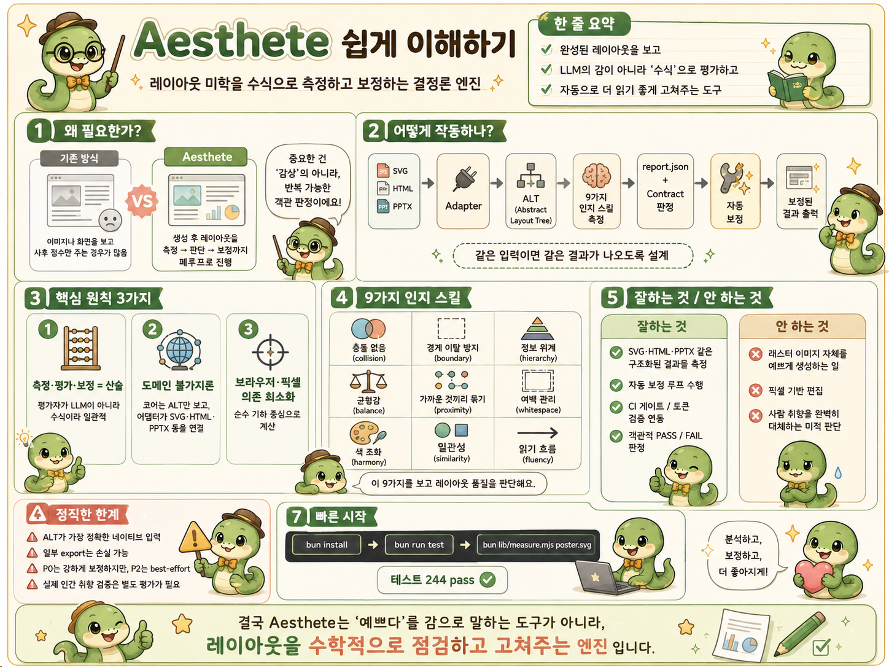

# Aesthete

[English](./README.md) | **한국어**

> 인지 미학 이론을 **결정론적 실행 모듈**로 캡슐화한 레이아웃 미학 측정·보정 엔진.
> 측정·평가·보정이 전부 순수 기하학 산술 — 평가자는 LLM이 아니라 **수식**이라 사후 합리화가 구조적으로 불가능하다.



[SKILL.md](./SKILL.md) · [DESIGN.md](./DESIGN.md) · [**LLM 사용법**](./docs/agent-llm-usage.md) · `bun run test` → **244 pass** ✅

---

## 왜?

전통적 계산 미학(IAA/IQA)은 완성된 이미지에 **사후 점수**를 매길 뿐, 생성 에이전트가 레이아웃을 만드는 **과정에 개입해 점진 개선**하지는 못한다. Aesthete는 인지 심학의 미학 원리(게슈탈트·Ngo 균형·보색 조화 등)를 기하학적으로 정형화해, 에이전트가 직접 실행할 수 있는 **재사용 가능한 인지 스킬**로 캡슐화한다.

```
대상(SVG/PPTX/HTML/...) ──adapter──► ALT(Abstract Layout Tree)
                                            │
        9 인지 스킬이 같은 수식으로 측정 ──► report.json
                                            │
        Sprint Contract(동결 루브릭) 대항 PASS/FAIL
                                            │
        폐루프 자동보정(measure→resolve→patch→re-measure)
                                            │
        보정된 ALT ──adapter──► 원 도메인(SVG/HTML/PPTX)
```

**핵심 원칙**
- **측정·평가·보정 = 산술**: 평가자가 LLM이 아니라 수식이라 합리화·편향 불가. 동일 입력 → 동일 출력(`Math.random`/`Date` 금지).
- **도메인 불가지론**: 코어는 ALT만 본다. SVG·PPTX·OOXML·HTML·Image를 어댑터가 ALT로 변환. 새 도메인 = 어댑터 한 쌍 추가(코어 수정 없음).
- **브라우저/픽셀 없음**: 순수 기하학. 픽셀이 필요한 부분(local-variance·이미지 영역)은 한계를 정직하게 명시.

## 역할·스코프 (뭘 하고 뭘 안 하는가)

> **"구조화된 레이아웃(SVG · HTML · PPTX · ALT)의 미학을, 생성 *후*에 *결정론적 기하*로 측정하고 보정한다."**

| 산출물 | 통제 시점 | 담당 |
|---|---|---|
| SVG / HTML / PPTX / ALT | **사후 기하 보정** | **aesthete 본령 ✅** |
| 래스터 이미지 (ChatGPT/나노바나나 등) | **사전 프롬프트 가이드 + 사후 AI-tell 탐지** | 별도 관심사 — 엔진이 pure-JS no-browser라 이 tells(해부학 오류·주파수 영역 지문)에 필요한 비전 모델을 호스트 못 한다. "기하가 없어서"가 아니다: 이미지 어댑터가 이미 픽셀에서 쿼드트리 기하를 추출해 구도 측정에 쓴다. raster AI-tell 탐지는 아예 다른 문제로 비전이 필요. [slop v2 spec §5](./docs/superpowers/specs/2026-07-23-slop-v2-medium-expansion.md#5-raster-images--out-of-scope-with-documented-reason) 참고. |

- **한다**: 구조화 산출물 사후 측정·보정 · 합리화 없는 객관 판정 · 에이전트 루프 내 반복 보정(점진 개선).
- **안 한다**: 래스터 이미지 미학 생성/편집 · 이미지 생성용 사전 프롬프트 design guideline.
- **보조로만**: 비전/MLLM이 요소 영역을 뽑아주면 래스터 구도 채점에 기여(본령 아님).

자세한 정립은 [`DESIGN.md` §0](./DESIGN.md#0-역할-정립-positioning--뭘-하고-뭘-안-하는가).

---

## 빠른 시작

```bash
bun install
bun run test

# 에이전트 원샷 (권장)
bun lib/skill-pre.mjs examples/dashboard-brief.json --out-dir /tmp/ae-pre
bun lib/skill-post.mjs examples/catalog-bad.layout.json --contract /tmp/ae-pre/contract.json --out-dir /tmp/ae-bad
bun lib/skill-gate.mjs examples/catalog-good.layout.json --out-dir /tmp/ae-g

# 전체 규칙: docs/agent-llm-usage.md

# 엔진 직접
bun lib/measure.mjs examples/catalog-bad.layout.json
bun lib/measure.mjs poster.svg
bun lib/measure.mjs deck.pptx

# 폐루프 자동보정
bun lib/fix.mjs examples/catalog-fixable.layout.json --contract examples/catalog.contract.json

# 토큰 샌드박스 CI 게이트 (승인 색/폰트만, 임의값은 exit 1)
bun lib/lint.mjs examples/catalog-good.layout.json

# 자가진화 튜너 (기본 dry-run; --apply는 최소 3쌍 필요, --profile로 격리)
bun lib/tune.mjs before.layout.json after.layout.json
bun lib/tune.mjs before.layout.json after.layout.json --apply --profile projA

# 전처리 preflight — artifact type별로 생성 전 목표(contract+budget+structure+negation) 출력
bun lib/preflight.mjs examples/dashboard-brief.json preflight.json --contract dash.contract.json
# → dash.contract.json 으로 fix/measure 수용 (사전 목표 = 사후 기준, 같은 contract)
# → structure(brief 신호로 추론 또는 --diversify 회전) + negation(brief.format으로 도메인 스코핑)

# 구조 검증 — 생성된 레이아웃이 요청받은 구조(structure)를 만족하는지 결정론 판정
bun lib/structure.mjs verify layout.alt evidence-grid    # PASS(exit 0) / FAIL(exit 1, CI 게이트)
bun lib/structure.mjs classify deck.pptx dashboard       # 감지된 구조 + 기하 metrics
# 폐루프: preflight(목표) → 생성 → structure verify(구조 수용) → fix --contract(기하 수용)
```

---

## 9 인지 스킬

각 스킬은 **관찰·측정·인지효과** 3계층 구조(제안서 명세). 모두 0나누기·NaN 가드 포함.

| 스킬 | 측정 방식 | 주요 메트릭 | 등급 |
|---|---|---|---|
| `collision` | 쌍별 bbox 겹침 | `count` | **P0** 하드 |
| `boundary` | 캔버스 이탈 | `overflowCount` | **P0** 하드 |
| `hierarchy` | 폰트 스케일 단위성 × WCAG 대비 | `clarity` | P1 |
| `balance` | Ngo 대칭균형 `BM = 1−(‖BMv‖+‖BMh‖)/2` | `BM` | P2 |
| `proximity` | 게슈탈트 RANG + PDL `P_group = exp(−α·d/d_ref)` | `fragmentedCount` / `falseAdjacencyCount` | P2 |
| `whitespace` | 점유 쿼드트리(픽셀 없음) | `freeRatio` | P2 |
| `harmony` | 보색 모멘트 평형 + analogous `max(R, momentBalance)` | `harmonyScore` | P2 |
| `similarity` | 같은 그룹+종류의 시각 일관성(크기/명도/색) | `inconsistentGroups` | P2 |
| `fluency` | 읽기 흐름(Z/F-pattern) + 크기-중요도 기울기 | `fluency` | P2 |

### 스킬 관계 그래프 (위상수학적 3관계)
`lib/graph.mjs`가 세 관계를 **선언적 엣지 데이터**로 정의(`GRAPH` export로 시각화·확장):
- **priority** — tier 위계(P0 > P1 > P2). 제약 충돌 시 상위 계층이 가독성을 선점.
- **conflict** — 대립 쌍(proximity↔whitespace 등)을 **동적 보상 가중치**(`compensationFactor`, 캔버스 면적 비례 연속 감쇠)로 타협. hard threshold 아님.
- **influence** — 상향 전이(hierarchy → proximity). urgency 부스트로 반영.

---

## 도메인 어댑터 — 코어는 불가지론, 하지만 export는 반쪽

코어는 ALT(Abstract Layout Tree)만 본다 — 도메인 불가지론. 그런데 **무손실 round-trip은 ALT(JSON)뿐**이다. 어댑터는 import(모든 도메인 → ALT)와 export(ALT → 도메인)를 짝으로 갖지만, export는 대부분 **평탄화·최소패키지·미구현**이다. 즉 이 엔진의 실제 영역은 **import-only 측정 + ALT가 네이티브**다. "전 도메인을 순수 JS로 열고 닫는다"가 아니다 — 솔직히.

| 도메인 | import → ALT | export ALT → | 비고 |
|---|:--:|:--:|---|
| `alt` | ✅ | ✅ | JSON 네이티브 — **유일한 무손실 round-trip**(캐노니컬 입력) |
| `svg` | ✅ | ⚠ | import: `<path>` 포함 도형 bbox, 백분율 길이, 전체 affine transform(`matrix`/`translate`/`scale`/`rotate`/`skew`) 합성, viewBox 원점 정규화, PowerPoint presentation attribute 의미 해석. 비표시 `<defs>`/marker와 평탄화된 `aria-hidden`·`role="img"` 내부를 제외하고, 패널·그림자 스택·연결선·주석 배지를 분류해 P0 충돌 오탐을 막는다. export는 **ALT 재출력**(원본 패치 아님) — `circle`/`ellipse`/`rect`는 보존, `<path>` Bézier·gradient·transform·stroke는 bbox-rect로 평탄화 |
| `html` | ✅ | ✅ | 명시 기하(절대좌표/`data-*`)만 — 플렉스/그리드 렌더링 bbox는 브라우저 필요 |
| `pptx` | ✅ | ⚠ | import: ZIP+슬라이드 XML `a:off/a:ext`(EMU) 결정론적. export는 **단일 슬라이드 최소 패키지**(마스터·테마·미디어·차트 미포함, shape는 rect) |
| `docx`/`xlsx` | ✅ | ❌ | 흐름/균일격자 근사 ALT(절대 좌표 없음). **export 없음** |
| `image` | ✅ | ❌ | 헤더에서 캔버스 크기 추출; **영역은 선언 필요**(픽셀 분할은 CV에 떠넘김). **export 없음** |

> export의 ✅는 "ALT를 해당 포맷으로 재출력함"이지 "원본을 무손실 보존함"이 아니다. svg/pptx는 손실 재출력(⚠), docx/xlsx/image는 export 자체가 없다(❌). 진짜 입력은 ALT다.

---

## 자가진화 + 토큰 샌드박스

- **🧬 자가진화 피드백 루프** (`lib/tune.mjs`): 사용자가 에이전트 산출물을 편집한 전후 ALT의 **차분 분석**(관련 쌍 거리 비율) → 근접성 `FRAG_FACTOR`·`RANG_RATIO`를 튜닝해 `skill-params.json`으로 역전파. 코드 수정 없이 인간 선호에 맞춰 진화.
- **⚖️ 튜닝 거버넌스** (단일 편집 → 전역 변동 방지): 기본 **dry-run**. `--apply`는 (a) 최소 표본(`MIN_PAIRS=3`쌍) 미달 시 **거부**(`--force`로만 우회), (b) **기본적으로 profile에만 기록** — 글로벌 `skill-params.json` 쓰기는 명시적 `--global`로만. 튜너는 cached 파라미터를 **clone**해 변이(차단·dry-run에도 캐시 오염 없음), 적용 전 이전 값을 `*.backup-NNN`(Date 없는 카운터)에 스냅샷(롤백). `bun lib/measure.mjs … --profile <name>` / `bun lib/fix.mjs … --profile <name>`로 해당 profile을 측정·보정에 적용(없으면 글로벌→기본값 폴백).
- **🔒 토큰 샌드박싱 CI** (`lib/lint.mjs` + `lib/tokens.mjs`): 에이전트의 "탈출구"(임의 핵사코드·옵션 외 폰트)를 정적 분석으로 검출 → exit 1(CI 거부). `tokens.json`으로 프로젝트 팔레트·타입스케일 오버라이드. **미학 contract와 독립 게이트** — 미학 양호해도 토큰 위반 가능.

---

## 아키텍처

```
lib/
  skills/        9 측정 스킬 + 레지스트리 (관찰·측정·인지효과 3계층) + symmetry(opt-in 아이콘/기하 축)
  adapters/      svg·html·pptx·ooxml·image ↔ ALT  (+ xml/zip/emu 유틸, 레지스트리)
  measure.mjs    ALT → 9스킬 측정 → report.json
  contract.mjs   Sprint Contract(동결 루브릭) 작성·평가 (순수 비교 → PASS/FAIL)
  graph.mjs      스킬 관계 그래프 (priority/conflict/influence + 동적 보상)
  fix.mjs        폐루프 자동보정 (단조 개선 게이트 + P0 서브루프 청소, 진동·NaN 방지)
  tune.mjs       자가진화 튜너 (diff → skill-params.json)
  preflight.mjs  전처리 — artifact type → 타입별 contract + 기하 budget + 금지 기본값(생성 전 목표)
  vuln.mjs       취약점 엔진 — 이산 known-bad 패턴 탐지(negation: no-focal·no-rhythm·type-accident·rainbow·even-split·ai-cliche)
  slop.mjs       AI-slop 시그니처 엔진 — vuln과 동형(시그니처 fold + overridable thresholds + advisory). v1 = HTML 리터럴 존재 스캔 전용(SVG/PPTX/LLM-judge = v2). 4축: palette(클리셰 indigo→violet→pink 그라디언트·glassmorphism·그라디언트 보더 [카드 상단 바 / 콜아웃 좌측 레일]), decoration(헤딩 내 이모지·이탤릭 헤딩 [Hallmark 게이트 38a — top AI tell]·아이콘 포화·장식 애니메이션), copy(LLM 마케팅 lexicon + fake-precision 수치[다중-9 % / 라운드 Nx 배수 — 연구 기반 tell] — 본문+헤딩 커버, 분리자 정규화; generic LLM-judge = v2 stub → 항상 unmeasured), template(trusted-by 로고 띠·hero 3종). 미보정 — 보수적 존재 floor, corpus 튜닝은 v2
  profiles.mjs   실행 프로파일 매트릭스 — 층마다 허용/금지/성공의 진실(measure-only/fix-geometry/llm-judge/human-gate)
  validate.mjs   검증 하네스 — A/B/C/D 점수 변형을 인간 평가 corpus 대비 상관 비교(demo corpus는 synthetic placeholder)
  diffview.mjs   before/after 한화면 뷰어 — fix 전후 SVG를 같은 adapter로 round-trip해 한 HTML에 좌우 비교+점수 delta
  harness.mjs    @design 하네스 (인지+토큰 통합 자동화)
  designspec.mjs @design 프론트메타 파서
  emit.mjs       ALT → 도메인 export (독립 CLI)
  lint.mjs       토큰 샌드박스 CI 게이트
  tokens.mjs     토큰 레지스트리 + 정적 분석
  skill-params.mjs  튜닝 가능한 인지 파라미터
  geometry/color/similarity/quadtree.mjs  순수 수학 (NaN 가드)
schemas/         alt·contract·report·common (JSON Schema 2020-12, additionalProperties:false)
examples/        catalog-{good,bad,fixable}.layout.json + catalog.contract.json
test/            bun:test + golden.mjs (zero-dep)
```

---

## CLI 명령어

### 에이전트 facade (권장)

| 명령 | 설명 |
|---|---|
| `bun lib/skill-pre.mjs <brief.json> [--out-dir DIR]` | 사전 → bullets + contract |
| `bun lib/skill-post.mjs <artifact> [--contract c] [--out-dir DIR]` | 사후 → decision (비파괴) |
| `bun lib/skill-gate.mjs <artifact>` | CI exit |

플레이북: [docs/agent-llm-usage.md](./docs/agent-llm-usage.md)

### 엔진

| 명령 | 설명 |
|---|---|
| `bun lib/measure.mjs <file> [report.json] [--profile <name>] [--symmetry]` | 측정 — 확장자로 도메인 자동 감지. `--profile` 적용. `--symmetry`: 아이콘/기하 전용 대칭 축 opt-in(레이아웃은 의도적 비대칭이 많아 기본 제외) |
| `bun lib/fix.mjs <file> --contract <c.json> [--emit svg\|html\|pptx\|alt] [--max-iters N] [--neural scores.json] [--profile <name>] [--aesthetic]` | 폐루프 보정 — **기본 P0 구조 청소만**(collision/이탈). `--aesthetic` 켜면 P1/P2 미학 shift(Goodhart 위험: 점수는 올라도 실 미학은 나빠질 수 있음). `*.fix-log.json`(신경 미충족 시 `best-effort`+`stoppedReason`, 점수=`geometryScore`) |
| `bun lib/lint.mjs <file>` | 토큰 샌드박스 — exit 0/1 |
| `bun lib/tune.mjs <before.json> <after.json> [--apply] [--force] [--profile <name> \| --global]` | 자가진화 튜닝 — `--apply`는 최소 3쌍 필요(미달 시 BLOCKED); 기본 profile 기록, 글로벌은 `--global` |
| `bun lib/contract.mjs build [brief.json] [contract.json]` | 기본 Sprint Contract 생성 |
| `bun lib/harness.mjs <file>` | @design 프론트메타 → 인지 스킬 + **디자인 토큰 준수** 통합 자동 평가 |
| `bun lib/preflight.mjs <brief.json> [preflight.json] [--contract c.json] [--diversify [log.json]]` | **전처리** — artifact type별 contract+budget+**structure**(구조 선행사)+negation. 구조 pick 우선순위: brief 신호(`inferStructure`) > `--diversify` 회전(`.aesthete/log.json`) > index 0. `--contract`로 fix에 먹일 루브릭 따로 출력(사전 목표=사후 기준). `brief.format`으로 negation 도메인 스코핑(CSS/web 게이트는 html 전용) |
| `bun lib/structure.mjs classify <alt\|svg\|pptx\|html> [type]` \| `verify <alt> <structureId>` | **구조 분류/검증** — `classify` 감지된 구조+기하 metrics; `verify` 요청받은 구조 만족 여부(PASS=exit 0 / FAIL=exit 1, CI 게이트). 서명(노드 수·면적 분산·열/행 클러스터·지배력·여백률) 기반 결정론; 명확치 않으면 `unknown` |
| `bun lib/overlay/svg.mjs <original.svg> <fixed.alt.json> [out.svg]` | **SVG overlay export** — fix된 ALT를 원본 svg 위에 `<g transform>` wrap로 적용(path·gradient·stroke 평탄화 없이 보존). closed-loop 안전: `fix`는 여전히 `bbox`를 고치고(measure가 읽음), 각 import 노드는 `_originalBbox`를 가지며 overlay가 그 delta로 transform을 도출 |
| `bun lib/overlay/pptx.mjs <original.pptx> <fixed.alt.json> [out.patches.json] [--slide N]` | **PPTX overlay export** — fix된 ALT를 원본 pptx에 적용하는 OfficeCLI `batch` 매니페스트(`{op:set, path:/slide[N]/shape[M], props:{x,y,w,h in EMU}}`) 출력(마스터·테마·차트 보존). 원본을 재파싱해 각 `<p:sp>`의 진짜 OfficeCLI shape-index를 매핑(중간 pic 포함 대응); positional 매칭, 불일치 시 throw |
| `bun lib/vuln.mjs <layout> [vuln-report.json] [--type dashboard\|marketing\|report\|diagram\|poster]` | **취약점 엔진** — 이산 known-bad 패턴(negation: no-focal·no-rhythm·type-accident·rainbow·even-split·ai-cliche·hanging-header). `--type`으로 맥락 주입 시 타입 의도에 모순되는 시그니처 억제(위양성 방지). advisory, `measure-only` |
| `bun lib/slop.mjs <artifact.html> [slop.json] [--type T] [--medium html]` | **slop 시그니처 엔진** — 4축(palette · decoration · copy · template) advisory AI-slop 탐지. v1: HTML 리터럴 존재 스캔 전용(SVG/PPTX/LLM-judge = v2); 모든 threshold는 `opts.thresholds[id]`로 overridable; 모든 finding은 `suggestionOnly`. `measure-only`, 미보정 |
| `bun lib/validate.mjs [corpus.json] [validate-report.json]` | **검증 하네스** — A/B/C/D 점수 변형(overallScore/measuredAestheticScore/hardIntegrityScore/coverageScore)을 corpus `humanScore`와 상관 비교 + baseline. demo corpus는 synthetic |
| `bun lib/diffview.mjs <layout\|svg> [out.html] [--contract c.json]` | **before/after 뷰어** — fix 전후 SVG를 같은 adapter로 round-trip해 좌우 한 화면에 + 점수 before→after delta. `out.html`을 브라우저로 열면 보정 효과 시각 비교 |

보정 결과 `outcome` enum: `pass | best-effort | no-improvement | budget-exhausted`. 신경 축(`--neural`) 미충족은 `best-effort` + `stoppedReason: neural-criteria-failed`(enum 위반 값 없음). CLI `score`는 순수 기하 가중 점수(`geometryScore`) — 신경 판정은 별도 표시.

---

## 정직한 한계 (순수 JS·브라우저 없음)

- **P0**: 이탈(boundary)은 보정 후 항상 0(클램프). 충돌(collision)은 **비겹침 배치가 가능한 입력**에서 0 — 노드들이 물리적으로 안 겹칠 수 없는 입력(캔버스 대비 합산 면적 과대 등)에선 잔존 충돌이 `collision.count`에 남는다(**"항상 0" 아님, best-effort**). **P2(균형/근접/색조)** 도 best-effort — `outcome`으로 솔직 보고.
- **측정 coverage·점수 분리**: 기하가 항상 측정 가능하진 않다(그룹 의미 없으면 `proximity`·`similarity` 판정 불가 → 중립 1 반환). 이게 종합 점수를 부풀리지 않게 보고서는 `skills[id].coverage`(measured/partial/unmeasurable) + `summary` 3분할 점수(`hardIntegrityScore`·`measuredAestheticScore`·`coverageScore`)를 낸다. `overallScore`는 legacy 포함값이니 소비자는 `measuredAestheticScore`+`coverageScore`를 볼 것. 각 `fix`는 `autoFixable`(기하 fixer 적용) · `suggestionOnly`(폰트/색/의미 — 인간·재생성)로 명시(자세히 [`DESIGN.md` §4.2](./DESIGN.md)).
- HTML 실렌더링 bbox·이미지 영역 자동추출·픽셀 local-variance는 브라우저/CV 필요 → 점유 쿼드트리/선언 기하로 대체(메타에 명시).
- **export는 반쪽** (위 도메인 표): 무손실 round-trip은 ALT(JSON)뿐. svg/pptx export는 손실 재출력(평탄화·최소패키지), docx/xlsx/image는 export 자체 없음. import-only 측정 엔진 + ALT가 네이티브.
- **검증은 "유효성 증명"이 아니다**: `examples/validation-corpus.json`(shipped demo)의 `humanScore`는 synthetic placeholder라 상관이 **순환적** — 하네스가 돌아감을 보일 뿐. `examples/ground-truth-corpus.json`은 라벨을 주입 결함 심각도로 바꿔 비순환화했고 ρ≈0.33으로 predict-mean baseline(0.0)을 이긴다 — 하지만 이것도 **엔지니어링된 구조 결함에 대한 심각도 캘리브레이션·직교성·위양성 없음을 보일 뿐**, 실 인간 미학 선호를 검증한 게 아니다. ρ=0.33은 "필요충분 아닌 약~중간 신호"이지 증명이 아니다. 실 인간 평가를 끼우면 그때 검증. Phase 4 하네스(`lib/bradley-terry.mjs` + `scripts/build-human-corpus.mjs`)가 배관: 쌍체 인간 투표 → Bradley-Terry humanScore → `validate.mjs` 상관. **정직한 범위**: ALT-레이아웃 선호(엔진 직접 도메인)를 검증하지 스크린샷 미학 선호는 아님(후자는 Phase 3 비전 hook으로 스크린샷→ALT 전환 + 실 평가자 필요 — 둘 다 외부). `validate.mjs`가 `smallSample`(n<30) 플래그를 줘서 소수 synthetic vote의 고ρ가 검증으로 오독되지 않게 한다.
- **slop 탐지는 매체별, v1 = HTML만**: slop tells는 매체마다 다르다 — HTML 클리셰(indigo→pink 그라디언트·마케팅 lexicon·이탤릭 헤딩·fake-precision 수치)가 PPTX tells(재고 chrome·기본 테마 색)나 SVG tells(템플릿 아이콘 path)나 raster-image tells(해부학 오류·주파수 영역 지문)와 다르다. 매체마다 자기 스캐너 + 보정된 시그니처 세트가 필요하다. v1이 HTML만 싣는 건 보정된 세트가 그것뿐이어서다. slop는 measure/vuln/structure와 나란히 있는 형제 측정 층이다 (별도 모듈인 이유는 코드 조직상 — 입력/출력 형태와 소비자가 달라서, 기하학적 비호환 때문이 아님). 로드맵:

  | 매체 | tells | 탐지 방법 | 상태 |
  |---|---|---|---|
  | HTML / web | 그라디언트 클리셰·마케팅 lexicon·이탤릭 헤딩·fake-precision·그라디언트 보더 | 리터럴 소스 스캔 (regex) | **v1 ✅** |
  | PPTX | 재고 chrome·기본 테마 색·글먹기 과다 레이아웃 | OOXML 풀기 + 패턴 매치 | v2 |
  | SVG | AI 기본 그라디언트 정지·템플릿 아이콘 path | path / stop 분석 | v2 |
  | Raster (ChatGPT / Nanobanana / …) | 해부학 오류·질감 artifact·조명 비일관성·주파수 지문 | **비전 모델 필요** (C2PA / 주파수 분석 / GAN 지문) | **범위 밖** — pure-JS no-browser 엔진은 비전 모델을 호스트할 수 없음; Phase 3 image/vision hook이 전제 |

  v2 스캐너 설계는 [`docs/superpowers/specs/2026-07-23-slop-v2-medium-expansion.md`](./docs/superpowers/specs/2026-07-23-slop-v2-medium-expansion.md) 참고.
- **범위 밖**(인프라 필요): 실제 GRPO 학습 루프(LLM 훈련), 물리적 다중 에이전트 세션 분리(본 스킬은 "평가자=산술"로 동등 효과 달성), PPTX 슬라이드 마스터/테마, **raster-image slop 탐지**(비전 모델 필요).

---

## 구현 요약

인지 스킬 프레임워크를 실제 동작하는 결정론적 스킬로 구현 — 관찰·측정·인지효과 3계층 스킬 모델, 스킬 관계 그래프(3관계), RANG/PDL·Ngo BM·Ratcliff-Obershelp·보색 모멘트 수식, Sprint Contract 격리(합리화 방지), 자가진화 피드백 루프, 토큰 샌드박싱, 도메인 불가지론적 ALT. 전부 순수 기하 산술로 캡슐화. 설계·수학·정형화 근거는 [`DESIGN.md`](./DESIGN.md).

---

## 참조 논문 (Cognitive Psychology & Neuro-Symbolic AI)

> 수식 **동기** 출처 (인간 미학 증명 아님). LLM 맵: [docs/refs/hci-cognition.md](./docs/refs/hci-cognition.md) · 사용법: [docs/agent-llm-usage.md](./docs/agent-llm-usage.md).

### 인지 미학·게슈탈트·Processing Fluency

| 논문 | 스킬 연계 |
|---|---|
| Wertheimer, M. (1923). *Untersuchungen zur Lehre von der Gestalt II.* — 게슈탈트 근접성 법칙 | `proximity` |
| Ngo, D. C. L. (2001). *Aesthetic Measures for Assessing Graphic Screens.* — BM 대칭균형 공식 | `balance` |
| Reber, R., Schwarz, N., & Winkielman, P. (2004). *Processing Fluency and Aesthetic Pleasure: Is Beauty in the Perceiver's Processing Experience?* **Personality and Social Psychology Review.** — 처리 유창성 이론 | `whitespace`, `fluency`, `hierarchy` |
| Topolinski, S., & Strack, F. (2009). *Motor Fluency.* — motor fluency 확장 | `fluency` |
| Treisman, A., & Gelade, G. (1980). *A Feature-Integration Theory of Attention.* — visual search 단계 | `hierarchy` |
| Birkhoff, G. D. (1933). *Aesthetic Measure.* — M = O/C (질서/복잡도) | `harmony` |
| Fan, T. et al. — 시각 복잡도 연구 (quadtree whitespace 적용) | `whitespace` |
| Symmetry (2024). Balanced composition and early visual processing. | `balance` |

### Neuro-Symbolic AI

| 논문 | 연계 |
|---|---|
| *Design Patterns for LLM-based Neuro-Symbolic Systems* (2025) — boxology/모듈 아키텍처 | neuro-symbolic seam |
| *Unlocking the Potential of Generative AI through Neuro-Symbolic AI* (arXiv, 2025) — NSAI 분류, 생성 디자인 | 아키텍처 참조 |
| *A Roadmap Toward Neurosymbolic Approaches in AI Design* (2025–26) — 신경→기호→추론 다단계 | ALT=기호 프로그램 |
| *Bridging Design and Fabrication via Neuro-Symbolic Visual Program Synthesis* (Stanford) — raw shape→vector layout 합성 | ALT=기호 프로그램 |
| *Neuro-Symbolic Generative Art* (Meta AI, 2020) — 신경 생성 + 기호 제약; human study 창의성↑ | 제약+미학 구도 |

---

## 라이선스

**Modified MIT + Commons Clause + Media Restrictions** (전문: [`LICENSE`](./LICENSE)). MIT 권한 부여 + 다음 제약:

1. **Commons Clause** — Software를 유료/consideration으로 제3자에게 제공(SaaS·호스팅·white-label·rebrand 포함)하는 **판매 금지**. 즉 OSI 정의의 "오픈소스"가 아니라 **source-available**.
2. **Media Restriction** — 저작권자 사전 서면 동의 없이 Software 소스코드·UI·파생물로 **공개 미디어 콘텐츠**(YouTube·Twitch·블로그 등에서의 방송·데모·리뷰·분석, 특히 타인 소유를 암시하는 상업/자기홍보 목적) 생성 금지.
3. 위반 시 권리 즉시 종료 · DMCA Takedown / YouTube Copyright Strike 등 집행.

Copyright © 2026 KLIC Co., Ltd.
