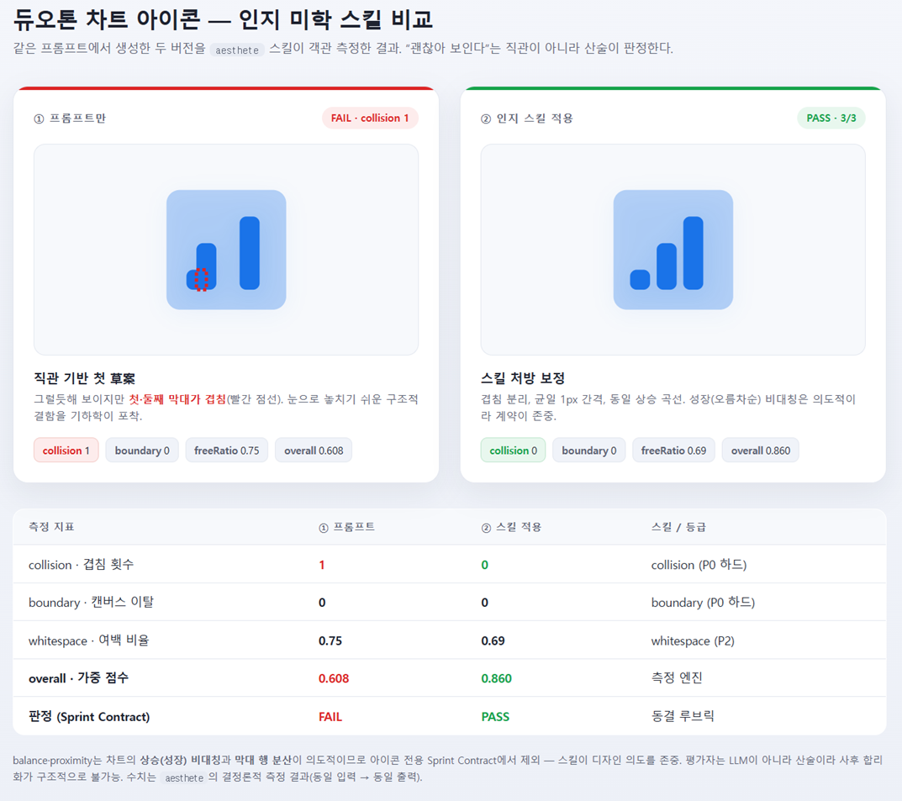

# Aesthete

**English** | [한국어](./README.ko.md)

> A layout-aesthetics measurement and correction engine that encapsulates cognitive-aesthetics theory as **deterministic execution modules**.
> Measuring, judging, and correcting are all pure geometric arithmetic — the evaluator is **formulas, not an LLM**, so post-hoc rationalization is structurally impossible.



[SKILL.md](./SKILL.md) · [DESIGN.md](./DESIGN.md) · [**LLM playbook**](./docs/agent-llm-usage.md) · `bun run test` → **244 pass** ✅

---

## Why?

Classical computational aesthetics (IAA/IQA) only **scores a finished image after the fact**; it cannot intervene in the **process** by which a generating agent builds a layout and improve it incrementally. Aesthete formalizes the aesthetic principles of cognitive psychology (Gestalt, Ngo balance, complementary-color harmony, …) geometrically, and encapsulates them as **reusable cognitive skills** an agent can execute directly.

```
target (SVG/PPTX/HTML/…) ──adapter──► ALT (Abstract Layout Tree)
                                            │
        9 cognitive skills measure with the same formulas ──► report.json
                                            │
        Sprint Contract (frozen rubric) adversarial PASS/FAIL
                                            │
        closed-loop auto-correction (measure → resolve → patch → re-measure)
                                            │
        corrected ALT ──adapter──► original domain (SVG/HTML/PPTX)
```

**Core principles**
- **Measure / judge / correct = arithmetic.** The evaluator is formulas, not an LLM, so rationalization and bias are impossible. Same input → same output (`Math.random` / `Date` forbidden).
- **Domain-agnostic core.** The core sees only ALT. Adapters convert SVG · PPTX · OOXML · HTML · Image into ALT. A new domain = one adapter pair (no core change).
- **No browser, no pixels.** Pure geometry. Where pixels are required (local-variance, image regions) the limitation is stated honestly.

## Role & scope (what it does and doesn't do)

> **"Measures and corrects the aesthetics of structured layouts (SVG · HTML · PPTX · ALT), *after* generation, with *deterministic geometry*."**

| Artifact | Control point | Owner |
|---|---|---|
| SVG / HTML / PPTX / ALT | **post-hoc geometric correction** | **aesthete's core purpose ✅** |
| Raster images (ChatGPT / Nanobanana / …) | **pre-generation prompt guidance** | a separate *design-guideline* domain (aesthete ❌ — pixels have no geometry) |

- **Does:** post-hoc measurement/correction of structured artifacts · bias-free objective judgement · iterative correction inside an agent loop (incremental improvement).
- **Does not:** generate/edit raster-image aesthetics · pre-generation prompt design guidelines for image generation.
- **Supporting only:** if a vision/MLLM extracts element regions, it can contribute to raster-composition scoring (not the core purpose).

See [`DESIGN.md` §0](./DESIGN.md) for the full positioning.

---

## Quick start

```bash
bun install
bun run test

# Agent one-shots (recommended)
bun lib/skill-pre.mjs examples/dashboard-brief.json --out-dir /tmp/ae-pre
# pre.json + contract.json + prompt_bullets.md

bun lib/skill-post.mjs examples/catalog-bad.layout.json --contract /tmp/ae-pre/contract.json --out-dir /tmp/ae-bad
# decision.json (input NOT mutated)

bun lib/skill-gate.mjs examples/catalog-good.layout.json --out-dir /tmp/ae-g
# exit 0 = pass; bad layouts exit 1

# Full LLM rules: docs/agent-llm-usage.md

# Engine direct
bun lib/measure.mjs examples/catalog-bad.layout.json
bun lib/measure.mjs poster.svg
bun lib/measure.mjs deck.pptx

# closed-loop auto-correction
bun lib/fix.mjs examples/catalog-fixable.layout.json --contract examples/catalog.contract.json

# token-sandbox CI gate (only approved colors/fonts; arbitrary values exit 1)
bun lib/lint.mjs examples/catalog-good.layout.json

# self-evolving tuner (dry-run by default; --apply needs ≥3 pairs, isolate with --profile)
bun lib/tune.mjs before.layout.json after.layout.json
bun lib/tune.mjs before.layout.json after.layout.json --apply --profile projA

# preflight — per artifact-type, emit the pre-generation goal (contract + budget + structure + negation)
bun lib/preflight.mjs examples/dashboard-brief.json preflight.json --contract dash.contract.json
# → dash.contract.json is consumed by fix/measure (pre-generation goal = post-hoc criterion, same contract)
# → structure (inferred from brief signal, or rotated via --diversify) + negation (scoped by brief.format)

# structure verification — does the generated layout satisfy the requested structure?
bun lib/structure.mjs verify layout.alt evidence-grid    # PASS (exit 0) / FAIL (exit 1, CI gate)
bun lib/structure.mjs classify deck.pptx dashboard       # detected structure + geometric metrics
# closed loop: preflight (goal) → generate → structure verify (shape acceptance) → fix --contract (geometric acceptance)
```

---

## The 9 cognitive skills

Each skill has a three-layer structure — **observe · measure · cognitive effect** (per the proposal spec). All include zero-division and NaN guards.

| Skill | How it measures | Key metric | Tier |
|---|---|---|---|
| `collision` | pairwise bbox overlap | `count` | **P0** hard |
| `boundary` | canvas overflow | `overflowCount` | **P0** hard |
| `hierarchy` | font-scale unitarity × WCAG contrast | `clarity` | P1 |
| `balance` | Ngo symmetrical balance `BM = 1−(‖BMv‖+‖BMh‖)/2` | `BM` | P2 |
| `proximity` | Gestalt RANG + PDL `P_group = exp(−α·d/d_ref)` | `fragmentedCount` / `falseAdjacencyCount` | P2 |
| `whitespace` | occupancy quadtree (no pixels) | `freeRatio` | P2 |
| `harmony` | complementary moment balance + analogous `max(R, momentBalance)` | `harmonyScore` | P2 |
| `similarity` | visual consistency (size/luminance/color) within same group+kind | `inconsistentGroups` | P2 |
| `fluency` | reading flow (Z/F-pattern) + size-importance gradient | `fluency` | P2 |

### Skill relationship graph (three topological relations)
`lib/graph.mjs` defines three relations as **declarative edge data** (exported as `GRAPH` for visualization/extension):
- **priority** — tier hierarchy (P0 > P1 > P2). On a constraint clash, the higher tier preempts legibility.
- **conflict** — opposing pairs (proximity↔whitespace, …) reconciled by a **dynamic compensation weight** (`compensationFactor`, continuous decay proportional to canvas area). Not a hard threshold.
- **influence** — upward transfer (hierarchy → proximity), reflected via an urgency boost.

---

## Domain adapters — the core is agnostic, but export is half

The core sees only ALT (Abstract Layout Tree) — domain-agnostic. But **the only lossless round-trip is ALT (JSON).** Adapters come in import (any domain → ALT) and export (ALT → domain) pairs, but exports are mostly **flattened / minimal-package / unimplemented**. So the engine's real territory is **import-only measurement + ALT as the native form.** It is *not* "open and close every domain losslessly in pure JS" — honestly.

| Domain | import → ALT | export ALT → | Notes |
|---|:--:|:--:|---|
| `alt` | ✅ | ✅ | JSON native — **the only lossless round-trip** (canonical input) |
| `svg` | ✅ | ⚠ | import: shape bbox incl. `<path>`, translate accumulation. export is **ALT re-emission** (not an original patch) — `circle`/`ellipse`/`rect` preserved; `<path>` Bézier·gradient·transform·stroke flatten to bbox-rect |
| `html` | ✅ | ✅ | explicit geometry only (absolute coords / `data-*`) — flex/grid rendered bbox needs a browser |
| `pptx` | ✅ | ⚠ | import: ZIP + slide XML `a:off/a:ext` (EMU), deterministic. export is a **single-slide minimal package** (no master/theme/media/charts; shapes are rects) |
| `docx`/`xlsx` | ✅ | ❌ | approximate flow / uniform-grid ALT (no absolute coords). **No export** |
| `image` | ✅ | ❌ | canvas size from header; **regions require declaration** (pixel segmentation is punted to CV). **No export** |

> A ✅ on export means "re-emits ALT into that format," not "losslessly preserves the original." svg/pptx are lossy re-emissions (⚠); docx/xlsx/image have no export at all (❌). The real input is ALT.

---

## Self-evolution + token sandbox

- **🧬 Self-evolving feedback loop** (`lib/tune.mjs`): diffs an ALT **before/after** a user edits an agent artifact (related-pair distance ratio) → tunes proximity `FRAG_FACTOR` / `RANG_RATIO` and back-propagates into `skill-params.json`. Evolves toward human preference with no code change.
- **⚖️ Tuning governance** (one edit must not sway globals): **dry-run** by default. `--apply` (a) is **refused** below the minimum sample (`MIN_PAIRS=3`) — only bypassable with `--force`; (b) **records to a profile by default** — writing the global `skill-params.json` requires explicit `--global`. The tuner **clones** cached params before mutating (no cache pollution on block/dry-run) and snapshots prior values to `*.backup-NNN` (date-free counter) before applying (rollback). Apply a profile to measure/fix via `bun lib/measure.mjs … --profile <name>` / `bun lib/fix.mjs … --profile <name>` (falls back to global → defaults if absent).
- **🔒 Token-sandbox CI** (`lib/lint.mjs` + `lib/tokens.mjs`): statically detects the agent's "escape hatches" (arbitrary hex, non-allowlisted fonts) → exit 1 (CI reject). `tokens.json` overrides the project palette / type scale. **An independent gate from the aesthetics contract** — good aesthetics can still violate tokens.

---

## Architecture

```
lib/
  skills/        9 measurement skills + registry (observe · measure · effect layers) + symmetry (opt-in icon/geometric axis)
  adapters/      svg·html·pptx·ooxml·image ↔ ALT  (+ xml/zip/emu utils, registry)
  measure.mjs    ALT → 9-skill measurement → report.json
  contract.mjs   Sprint Contract (frozen rubric) build + evaluate (pure comparison → PASS/FAIL)
  graph.mjs      skill relationship graph (priority/conflict/influence + dynamic compensation)
  fix.mjs        closed-loop auto-correction (monotonic-improvement gate + P0 sub-loop cleanup; anti-oscillation, anti-NaN)
  tune.mjs       self-evolving tuner (diff → skill-params.json)
  preflight.mjs  pre-generation — artifact type → type-tuned contract + geometric budget + banned defaults (generation goal)
  structure.mjs  structural classifier/verifier — geometric signatures (classify / verify)
  diversify.mjs  .aesthete/log.json structure rotation (--diversify)
  vuln.mjs       vulnerability engine — discrete known-bad patterns (negation: no-focal·no-rhythm·type-accident·rainbow·even-split·ai-cliche·hanging-header)
  profiles.mjs   execution-profile matrix — per-tier truth of allowed/forbidden/success (measure-only/fix-geometry/llm-judge/human-gate)
  validate.mjs   validation harness — A/B/C/D score variants correlated against a human-rated corpus (demo corpus is synthetic placeholder)
  diffview.mjs   before/after single-screen viewer — round-trips pre/post-fix SVG through the same adapter into one HTML, side-by-side + score delta
  harness.mjs    @design harness (cognition + token integrated automation)
  designspec.mjs @design front-matter parser
  emit.mjs       ALT → domain export (standalone CLI)
  lint.mjs       token-sandbox CI gate
  tokens.mjs     token registry + static analysis
  skill-params.mjs  tunable cognitive parameters
  geometry/color/similarity/quadtree.mjs  pure math (NaN-guarded)
schemas/         alt·contract·report·common (JSON Schema 2020-12, additionalProperties:false)
examples/        catalog-{good,bad,fixable}.layout.json + catalog.contract.json
test/            bun:test + golden.mjs (zero-dep)
```

---

## CLI

### Agent facade (recommended)

| Command | Description |
|---|---|
| `bun lib/skill-pre.mjs <brief.json> [--out-dir DIR] [--diversify]` | Pre one-shot → pre.json + contract.json + prompt_bullets.md |
| `bun lib/skill-post.mjs <artifact> [--contract c] [--structure ID] [--lint] [--vuln-gate] [--out-dir DIR]` | Post one-shot → decision.json (non-destructive). No LLM judging |
| `bun lib/skill-gate.mjs <artifact> [same flags]` | CI — pass=0; fix_geometry or regenerate=1; human or usage=2 |

package.json scripts: pre / post / gate. Short skills: skills/aesthete-*/SKILL.md. Playbook: [docs/agent-llm-usage.md](./docs/agent-llm-usage.md).

### Engine

| Command | Description |
|---|---|
| `bun lib/measure.mjs <file> [report.json] [--profile <name>] [--symmetry]` | measure — domain auto-detected by extension. Applies `--profile`. `--symmetry`: opt-in icon/geometric symmetry axis (layouts are often deliberately asymmetric, so off by default) |
| `bun lib/fix.mjs <file> --contract <c.json> [--emit svg\|html\|pptx\|alt] [--max-iters N] [--neural scores.json] [--profile <name>] [--aesthetic]` | closed-loop correction — **P0 structural cleanup only by default** (collision/boundary). `--aesthetic` enables P1/P2 aesthetic shifts (Goodhart risk: scores may rise while real aesthetics worsen). `*.fix-log.json` (on neural shortfall: `best-effort` + `stoppedReason`; score = `geometryScore`) |
| `bun lib/lint.mjs <file>` | token sandbox — exit 0/1 |
| `bun lib/tune.mjs <before.json> <after.json> [--apply] [--force] [--profile <name> \| --global]` | self-evolving tuning — `--apply` needs ≥3 pairs (below → BLOCKED); records to a profile by default, global requires `--global` |
| `bun lib/contract.mjs build [brief.json] [contract.json]` | build a default Sprint Contract |
| `bun lib/harness.mjs <file>` | @design front-matter → cognitive skills + **design-token compliance** integrated auto-evaluation |
| `bun lib/preflight.mjs <brief.json> [preflight.json] [--contract c.json] [--diversify [log.json]]` | **pre-generation** — per artifact-type contract + budget + **structure** (shape prior) + negation. Structure pick precedence: brief signal (`inferStructure`) > `--diversify` rotation (`.aesthete/log.json`) > index 0. Emits the fix-consumed rubric separately via `--contract` (pre-generation goal = post-hoc criterion). `brief.format` scopes negation by domain (CSS/web gates are html-only) |
| `bun lib/structure.mjs classify <alt\|svg\|pptx\|html> [type]` \| `verify <alt> <structureId>` | **structure classify/verify** — `classify` returns detected structure + geometric metrics; `verify` returns whether the requested structure holds (PASS=exit 0 / FAIL=exit 1, CI gate). Signature-based deterministic (node count · area spread · col/row clusters · dominance · free-ratio); returns `unknown` when unclear |
| `bun lib/overlay/svg.mjs <original.svg> <fixed.alt.json> [out.svg]` | **SVG overlay export** — applies the fixed ALT as `<g transform>` wraps on the ORIGINAL svg (path / gradient / stroke preserved — no flattening). Closed-loop-safe: `fix` still mutates `bbox` (measure reads it); each imported node carries `_originalBbox`, and overlay derives the transform delta from it |
| `bun lib/overlay/pptx.mjs <original.pptx> <fixed.alt.json> [out.patches.json] [--slide N]` | **PPTX overlay export** — emits an OfficeCLI `batch` manifest (`{op:set, path:/slide[N]/shape[M], props:{x,y,w,h in EMU}}`) applying the fixed ALT to the ORIGINAL pptx (masters/themes/charts preserved). Re-parses the original to map each `<p:sp>` to its true OfficeCLI shape-index (handles interspersed pics); positional match, throws on mismatch |
| `bun lib/vuln.mjs <layout> [vuln-report.json] [--type dashboard\|marketing\|report\|diagram\|poster]` | **vulnerability engine** — discrete known-bad patterns (negation: no-focal·no-rhythm·type-accident·rainbow·even-split·ai-cliche·hanging-header). `--type` injects context and suppresses signatures that contradict the type's intent (avoids false positives). advisory, `measure-only` |
| `bun lib/validate.mjs [corpus.json] [validate-report.json]` | **validation harness** — correlates A/B/C/D score variants (overallScore / measuredAestheticScore / hardIntegrityScore / coverageScore) against the corpus `humanScore` + baseline. The demo corpus is synthetic |
| `bun lib/diffview.mjs <layout\|svg> [out.html] [--contract c.json]` | **before/after viewer** — round-trips pre/post-fix SVG through the same adapter, side-by-side on one screen + score before→after delta. Open `out.html` in a browser to visually compare the correction |

The correction `outcome` enum: `pass | best-effort | no-improvement | budget-exhausted`. A neural-axis (`--neural`) shortfall yields `best-effort` + `stoppedReason: neural-criteria-failed` (no enum-violating value). The CLI `score` is the pure-geometric weighted score (`geometryScore`) — the neural verdict is shown separately.

---

## Honest limitations (pure JS · no browser)

- **P0**: boundary overflow is always 0 after correction (clamped). collision is 0 for inputs where a non-overlapping placement is **possible** — for inputs where the nodes physically cannot avoid overlap (e.g. total area too large for the canvas), residual collisions remain in `collision.count` (**not "always 0" — best-effort**). **P2 (balance/proximity/color)** is also best-effort — reported honestly via `outcome`.
- **Measurement coverage / score separation**: geometry is not always measurable (without group semantics, `proximity`/`similarity` can't be judged → return neutral 1). So the score isn't inflated: the report carries `skills[id].coverage` (measured/partial/unmeasurable) + a 3-way `summary` score (`hardIntegrityScore` · `measuredAestheticScore` · `coverageScore`). `overallScore` is a legacy inclusive value — consumers should read `measuredAestheticScore` + `coverageScore`. Each `fix` is marked `autoFixable` (geometric fixer applies) or `suggestionOnly` (font/color/meaning — human or regeneration). See [`DESIGN.md` §4.2](./DESIGN.md).
- HTML rendered bbox, image-region auto-extraction, and pixel local-variance need a browser/CV → replaced by occupancy quadtree / declared geometry (noted in metadata).
- **Export is half** (see the domain table above): the only lossless round-trip is ALT (JSON). svg/pptx export is lossy re-emission (flattened / minimal package); docx/xlsx/image have no export at all. Import-only measurement engine + ALT as native.
- **Validation is not a "validity proof."** `examples/validation-corpus.json` (shipped demo) has synthetic-placeholder `humanScore`, so its correlation is **circular** — it only proves the harness runs. `examples/ground-truth-corpus.json` replaces labels with injected-defect severity (non-circular) and beats the predict-mean baseline (0.0) at ρ≈0.33 — but even that only demonstrates **severity-calibration / orthogonality / no-false-positives on engineered structural defects**, not real human aesthetic preference. ρ=0.33 is a "weak-to-moderate, necessary-not-sufficient" signal, not a proof. Plug in real human ratings → then it's validation. The Phase 4 harness (`lib/bradley-terry.mjs` + `scripts/build-human-corpus.mjs`) is the plumbing: pairwise human votes → Bradley-Terry humanScore → `validate.mjs` correlation. **Honest scope**: it validates ALT-LAYOUT preference (the engine's direct domain), not screenshot aesthetic preference (that needs the Phase 3 image/vision hook to turn screenshots into ALTs, plus real raters — both external). `validate.mjs` flags `smallSample` (n<30) so a high ρ from a few synthetic votes can't be misread as validation.
- **Out of scope** (needs infrastructure): a real GRPO training loop (LLM training), physical multi-agent session isolation (this skill achieves the equivalent via "evaluator = arithmetic"), PPTX slide masters/themes.

---

## Implementation overview

The cognitive-skill framework is implemented as working, deterministic skills — the observe/measure/effect three-layer skill model, the skill-relationship graph (three relations), the RANG/PDL · Ngo BM · Ratcliff-Obershelp · complementary-moment formulas, Sprint Contract isolation (anti-rationalization), the self-evolving feedback loop, token sandboxing, and the domain-agnostic ALT. Everything is encapsulated as pure geometric arithmetic. Full design, math, and formalization rationale in [`DESIGN.md`](./DESIGN.md).

---

## Reference papers (Cognitive Psychology & Neuro-Symbolic AI)

> Formulas are **motivated** by these works — not a proof of human aesthetic truth. Agent map: [docs/refs/hci-cognition.md](./docs/refs/hci-cognition.md).

### Cognitive aesthetics · Gestalt · Processing Fluency

| Paper | Skill link |
|---|---|
| Wertheimer, M. (1923). *Untersuchungen zur Lehre von der Gestalt II.* — Gestalt proximity law | `proximity` |
| Ngo et al. (2000). *Aesthetic Measures for Assessing Graphic Screens.* JISE 16 — [doi:10.1688/JISE.2000.16.1.6](https://doi.org/10.1688/JISE.2000.16.1.6) | `balance` (BM) |
| Reber, Schwarz, Winkielman (2004). *Processing Fluency…* PSPR 8(4) — [doi:10.1207/s15327957pspr0804_3](https://doi.org/10.1207/s15327957pspr0804_3) · [PubMed](https://pubmed.ncbi.nlm.nih.gov/15582859/) | `whitespace`, `fluency`, `hierarchy` |
| Topolinski, S., & Strack, F. (2009). *Motor Fluency.* — motor-fluency extension | `fluency` |
| Treisman and Gelade (1980). *Feature-Integration Theory…* Cogn Psychol — [doi:10.1016/0010-0285(80)90005-5](https://doi.org/10.1016/0010-0285(80)90005-5) | `hierarchy` |
| Sweller, J. (1988). *Cognitive load during problem solving…* Cognitive Science 12(2) — [Wiley](https://onlinelibrary.wiley.com/doi/abs/10.1207/s15516709cog1202_4) | CLT → P0 hard / clutter framing |
| Birkhoff, G. D. (1933). *Aesthetic Measure.* — M = O/C (order/complexity) | `harmony` |
| Fan, T. et al. — visual-complexity research (quadtree whitespace application) | `whitespace` |
| Symmetry (2024). Balanced composition and early visual processing. | `balance` |

### Neuro-Symbolic AI

| Paper | Link |
|---|---|
| *Design Patterns for LLM-based Neuro-Symbolic Systems* (2025) — boxology / modular architecture | neuro-symbolic seam |
| *Unlocking the Potential of Generative AI through Neuro-Symbolic AI* (arXiv, 2025) — NSAI taxonomy, generative design | architecture reference |
| *A Roadmap Toward Neurosymbolic Approaches in AI Design* (2025–26) — neural→symbolic→reasoning multi-stage | ALT = symbolic program |
| *Bridging Design and Fabrication via Neuro-Symbolic Visual Program Synthesis* (Stanford) — raw shape → vector layout synthesis | ALT = symbolic program |
| *Neuro-Symbolic Generative Art* (Meta AI, 2020) — neural generation + symbolic constraints; human-study creativity↑ | constraint + aesthetics framing |

---

## License

**Modified MIT + Commons Clause + Media Restrictions** (full text: [`LICENSE`](./LICENSE)). MIT grant plus the following constraints:

1. **Commons Clause** — **no Selling** the Software (providing it to third parties for a fee/consideration, incl. SaaS · hosting · white-label · rebrand). I.e. this is **source-available**, not "open source" under the OSI definition.
2. **Media Restriction** — without the Copyright Holder's prior written consent, the Software's source code · UI · derivatives may not be used to create **public media content** (broadcasts · demos · reviews · analysis on YouTube · Twitch · blogs, especially where commercial monetization / self-promotion misrepresents ownership).
3. Violation terminates all rights immediately · enforced via DMCA Takedown / YouTube Copyright Strike, etc.

Copyright © 2026 KLIC Co., Ltd.
